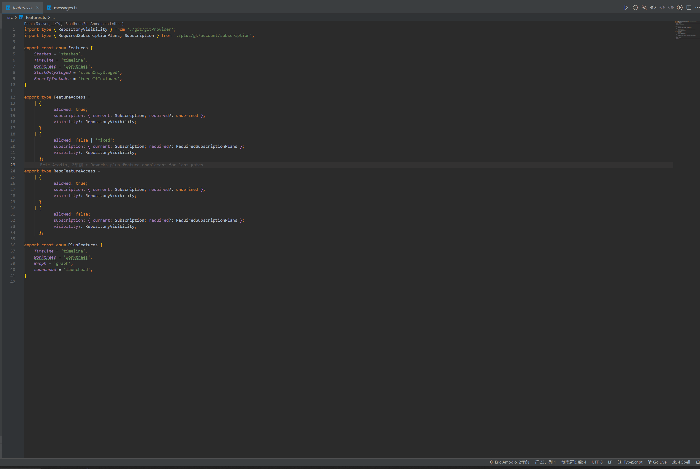

### 中文版 README.md

# VS Code Mini Git Blame 插件

## 插件简介

该插件为 VS Code 提供了类似 WebStorm 的 "Annotate with Git Blame" 功能。右键点击 "Annotate with Git Blame" 即可在代码每一行旁边显示该行的 Git 提交记录（包括提交哈希、作者和日期）。

如果安装了 GitLens 插件，还可以点击提交记录直接跳转到 GitLens 提供的提交图（Commit Graph）。

## 功能特点

- **显示 Git 提交记录**：展示每行代码的提交信息。
- **与 GitLens 集成**：点击提交记录可以跳转到 GitLens 的提交图。
- **快速清理**：右键清除所有注解。

## 使用方法

1. 右键代码文件，选择 "Annotate with Git Blame"。
2. 如安装了 GitLens，点击提交记录可跳转到提交图。
3. 使用 "Clear Annotate" 清理注解。

## 安装

在 VS Code 扩展市场搜索并安装 "Mini Git Blame"。

---

### English README.md

# VS Code Mini Git Blame Extension

## Introduction

This extension brings WebStorm's "Annotate with Git Blame" feature to VS Code. Right-click and select "Annotate with Git Blame" to display Git commit information (commit hash, author, and date) next to each line of code.

If GitLens is installed, you can also click on the commit info to navigate to the GitLens Commit Graph.

## Features

- **Display Git Commit Info**: Shows commit details for each line.
- **GitLens Integration**: Click to jump to GitLens Commit Graph.
- **Quick Clear**: Right-click to clear annotations.

## Usage

1. Right-click in a code file and select "Annotate with Git Blame."
2. If GitLens is installed, click commit info to open the commit graph.
3. Use "Clear Annotate" to remove annotations.

## Installation

Search for "Mini Git Blame" in the VS Code marketplace and install.

---

This version is more concise but retains all essential information about the plugin.